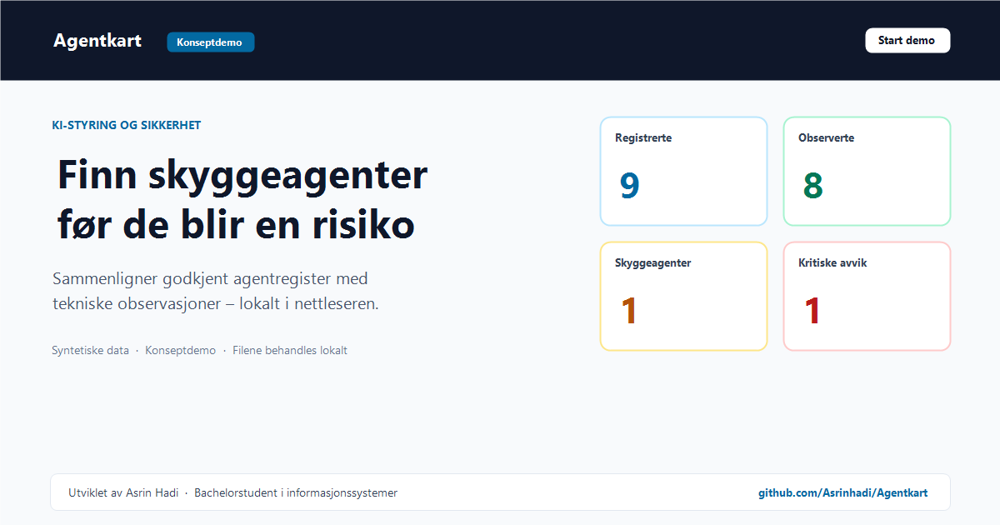

# Agentkart

Agentkart er en konseptdemo for styring og sikkerhetsoppfølging av KI-agenter. Løsningen sammenligner et godkjent agentregister med tekniske observasjoner og synliggjør skyggeagenter, manglende eierskap og andre kontrollavvik.

**[Åpne live-demoen](https://agentkart-one.vercel.app/)**



> Demoen bruker syntetiske eksempeldata. Importerte JSON-filer behandles lokalt i nettleseren og sendes ikke til en backend.

## Hovedfunksjoner

- Avstemming i fire tilstander: registrert + observert, observert med avvik, registrert ikke observert, og skyggeagent
- Klassifisering av hver agent som **Verktøy · Automasjon · Agent** basert på fire ja/nei-kriterier
- Ordinal risikovurdering – fem dimensjoner (rettigheter, data, autonomi, rekkevidde, reversibilitet), ingen gjennomsnitt, «Ukjent» som eget nivå
- Åtte kontrollregler (AK-R1…AK-R8) med kildehenvisning til interne policyer, EU AI Act, NIST AI RMF, ISO/IEC 27001/42001 og OWASP LLM Top 10
- Signalkatalog og eksplisitt dekning (%) per datakilde
- Prioriterte funn med evidens, kilde og anbefalt tiltak
- Bokmerkbare URL-drevne filtre for registerstatus, kontrollstatus, miljø og datakilde
- Lokal JSON-import med streng Zod-validering
- Utskriftsvennlig styringsrapport («Lagre som PDF»)
- Sikkerhetsherdet: streng CSP, ingen backend, ingen persistens

## Teknologi

React · TypeScript · Vite · Tailwind CSS · React Router · Zod · Vitest

## Kjør lokalt

```bash
git clone https://github.com/Asrinhadi/Agentkart.git
cd Agentkart
npm install
npm run dev
```
